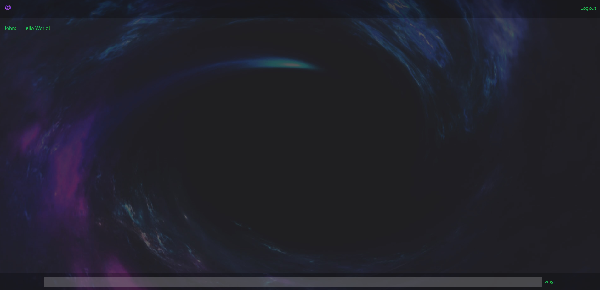

  
  # Void Chat

  ## Description

  Void Chat is a custom-built chat application that facilitates real-time communication between users, utilizing Google and GitHub authentication for seamless and secure access. This project marked my initial experience with OAuth authentication, web sockets, and the intricacies of client-server interactions during deployment. By employing TypeScript for the backend and a React/TypeScript combination for the frontend, I successfully created a cohesive and interactive chat room as a demonstrative showcase.

  ## Table of Contents

  - [Installation](#installation)
  - [Usage](#usage)
  - [License](#license)
  - [Contributions](#contributions)
  - [Questions](#questions)

  ## Installation

  npm i in the root, client, and the server -> npm run dev 

  ## Usage

  Just follow the link at: https://voidchat.herokuapp.com/ and sign in using github or google. Then type away!
  

  ## License

  This application is covered under the MIT license. Read more at [License: MIT](https://opensource.org/licenses/MIT)

  ## Contributions

  If you come across any bugs or wish to contribute in some other way, please email me at sciclunajl@gmail.com with details.

  ## Questions

  1. Where can I find your github so that I can view your other projects? https://github.com/scicluna

  2. What email address should I use to contact you regarding further opportunities or questions? sciclunajl@gmail.com
